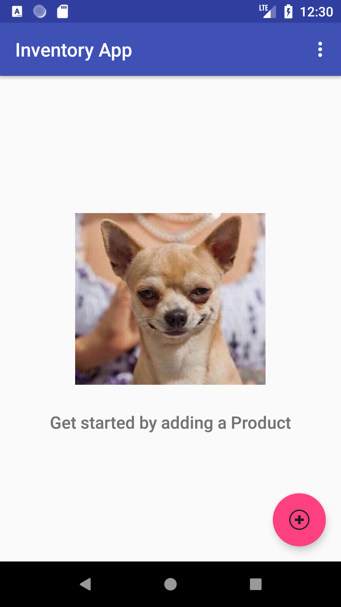
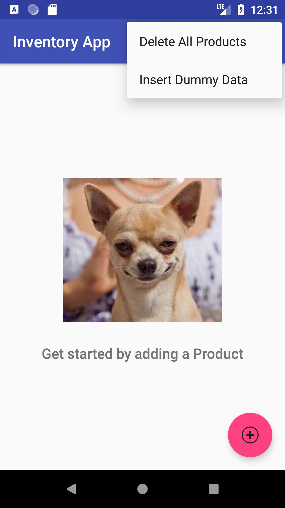
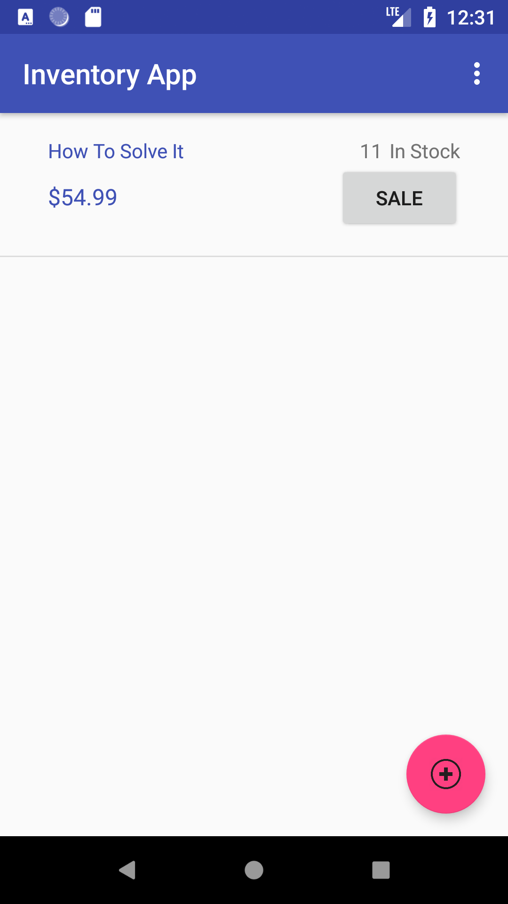
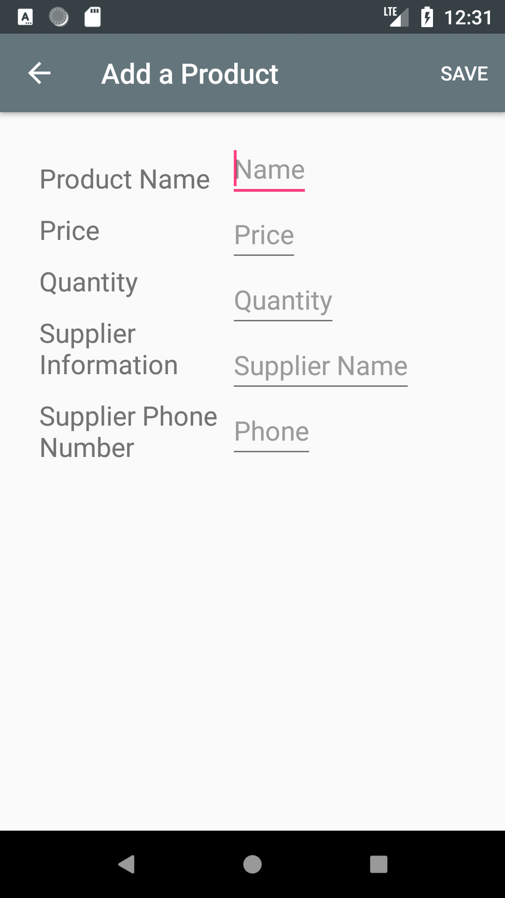

# Project 9: Inventory App, Stage 2

## in this project

- Creating a SQLite table in your app
- Populating that table with new entries
- Modifying the entries
- Displaying the contents of the table to users.
- Add Inventory
- See Product Details
- Edit Product Details
- See a list of all inventory from a Main Activity

### Screenshots

  -------------&rarr;
 
 -------------&rarr; 
 

--------------------------------- 
